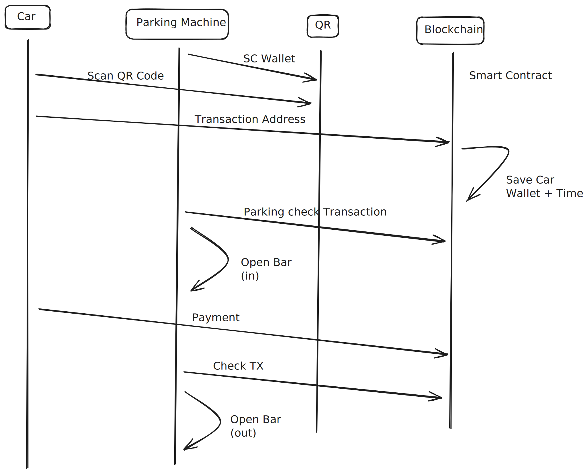

# documentation



## Raspberry Pi

### SSH

```bash
ssh pi@raspberrypi.local
cd SPC-services
v4l2-ctl --list-devices
npm install -g solc
pip install .
pip3 install py-solc-x
cp example.env .env
python client qr
```
